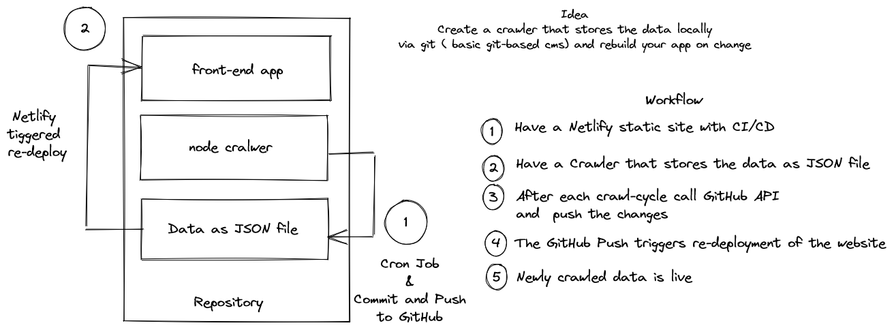

# Git-based Crawler



This project is a proof-of-concept - create a simple crawler, that instead of using DBs (and trying to find a good free solution), uses a local JSON file to save its data. This static JSON file is used for generating a static website. The crawler is being called by a CRON job at a specific time everyday and when saving to the JSON we trigger the website to be re-build.

## General workflow
1) Have a local JSON file
2) Node crawler gathers data and adds it to the JSON file
3) Commit and push the changes via GitHub API
4) Deploy your website on Netlify with CI/CD
5) Pushing the data from the crawler triggers re-deployment from Netlify
6) The website is re-generated with the new data from the JSON file
7) Add a CRON job to trigger this every day


## Test the project localy
You will need Node to test this project. The crawler is based under `/crawler` and it's a simple setup of `axios` + `cheerio`. The front-end is a basic `Nuxt 3` project (I wanted to test how Nuxt 3 behaves for SSG).

### Setup

Make sure to install the dependencies:

```
# yarn
yarn install

# npm
npm install

# pnpm
pnpm install --shamefully-hoist
```

### Development Server

Start the development server on http://localhost:3000
```
npm run dev
```

### Production

Build the application for production:
```
npm run generate
```